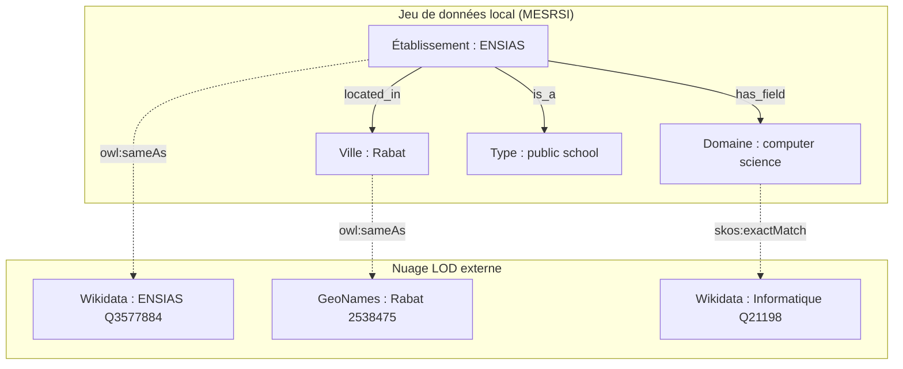

# 02_carte_des_liens.md

## 1. Inventaire des entités

| Entité ou type d'entité | Exemple local | Pourquoi s'agit-il d'une entité ? | Attributs associés | Identifiant local potentiel |
| --- | --- | --- | --- | --- |
| Établissement | ENSIAS | Concept central de l'observation, doté de caractéristiques propres (site web, date de création). | `institution_name`, `short_name`, `website`, `year_created` | `etab_ensias_rabat` |
| Ville | Rabat | Concept géographique autonome, point d'ancrage de plusieurs établissements. | `city`, `country` | `ville_rabat` |
| Domaine disciplinaire | computer science | Concept thématique réutilisable permettant de catégoriser l'offre de formation. | `main_field` | `domaine_computer_science` |

## 2. Relations conceptuelles observées

| Source | Relation conceptuelle | Cible | Cardinalité | Commentaire |
| --- | --- | --- | --- | --- |
| Établissement | `est situé dans` | Ville | n:1 | Un établissement est rattaché à une localisation géographique principale. |
| Établissement | `est de type` | Type d'institution | n:1 | Classification administrative (ex: école d'ingénieurs). |
| Établissement | `enseigne le domaine` | Domaine disciplinaire | n:m | Liaison thématique pour regrouper les écoles par spécialité. |

## 3. Liens externes proposés

| Entité locale | Ressource externe candidate | Type de lien envisagé | Critères d'appariement | Justification | Bénéfice attendu | Niveau de confiance | Risque |
| --- | --- | --- | --- | --- | --- | --- | --- |
| ENSIAS | Wikidata (`Q3577884`) | `owl:sameAs` | `short_name` exact + `city` identique | Désambiguïsation parfaite de l'entité dans le web de données. | Accès à des attributs externes (géolocalisation précise, directeurs, tutelle). | Élevé | Faible |
| Rabat | GeoNames (`2538475`) | `owl:sameAs` | `city` exacte + pays (Maroc) | GeoNames est le standard LOD pour les entités spatiales. | Permet des requêtes géospatiales complexes. | Élevé | Faible |
| computer science | Wikidata (`Q21198`) | `skos:exactMatch` | Traduction sémantique du `main_field` | Standardisation du vocabulaire disciplinaire. | Interopérabilité avec d'autres datasets éducatifs internationaux. | Moyen | Glissement sémantique (généralisation excessive). |

## 4. Schéma conceptuel

